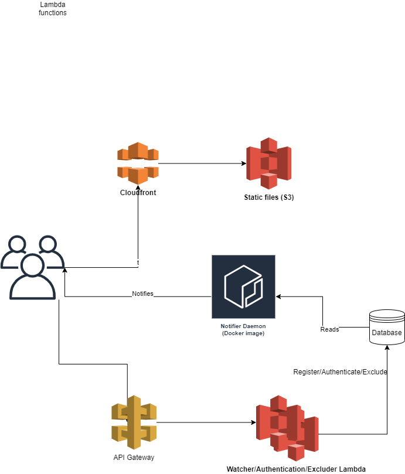

## Overview

Upon receiving a URL, this tool captures an initial snapshot of the content and alerts you if any changes occur. It also features an exclusion function allowing you to filter out specific content, such as cookies or other elements, from the output.

The user interface enables you to set up multiple web pages as needed. Additionally, it offers a feature-rich interface where you can specify and exclude particular text or HTML chunks, preventing them from triggering a change detection alert.

## Motivation

This was a hubby project of mine aiming to get my hands dirty with Golang. While I initially planned to expand its features, I've had to set it aside temporarily due to pressing personal commitments.

The inspiration for this project struck when I needed to secure an appointment from an embassy's website. They released a limited number of slots daily and I wanted to be one of the first people to be notified. This sort of websites usually don't require authentication and therefore it's easy to set up a crawler. However, I didn't want to be constantly checking the website and I wanted to be notified when the website changed. I also wanted to be able to exclude certain parts of the website from the change detection as they were irrelevant to me.

## Ideas for future features

- [ ] Create a microservice from the dameon in the monitoring-daemon/ folder
- [ ] Finalise the UI to allow users to add exclusions and get snapshots

## Architecture

The architecture is based on AWS serverless components. The main components are:

- API Gateway: to expose the API
- Lambda: Lambda to register new URLs, add exclusions and get snapshots
- DynamoDB: to store the snapshots



## How to run

### Prerequisites

- AWS account
- Terraform
- AWS CLI
- Golang
- NodeJS

After installing the above dependencies, run the following commands:

```bash
cd monitoring-daemon
go run main.go
```

## Components

- Notifer: a cron job (could be a microservice) that constantly keeps track of all watching URLs and notify the users when something changed (could be done in Go)

## UI

Pages:

- Watched URLs
  - Excluder
- (if no watched URLs) A simple Button to say Watch a new URL and a form to register the URL

## Lambdas

- Watcher POST /register -d {url: string}
- Register
- Exclude chunk from URL

## Data model

### Normalised

Users {
userId: string (primaryKey)
userName: string;
}

WatchedURL {
userId: string (primaryKey)
url: string (sortKey)
createdDateTime: datetime;
state: "open" | "closed"
}

Snapshots {
userId: string (primaryKey)
url: string (primaryKey)
snapshot: string
}

Exclusion {
userId: string (primaryKey)
url: string (primaryKey)
exclusion: string
}

## Queries

The table design is created in a way to create the most efficient queries possible but overloading the sort key field and storing data about essentially three different entity types: URLs, Snapshots and Exclusions

By Pages
Home page:

1. Get all watched URLs by the userId (whether the user is watching any URLs)

Watched URLs

1. Get all watched URLs by the userId

Register watching new URL:

1. Add new URL for the user

Snapshots:

1. Get all snapshots by UserId and URL

Add new exclusion

1. Add new exclusion by UserId and URL

By Daemon:

1. Get all watched URLs#
2. Write new snapshot for a UserId and URL
3. Get all exclusion by UserId and URL

### Denormalised based on the queries

WatchedUrl {
userId: string (primaryKey)
sk: string (one of the folowing patterns)

- URL#http:/...
- snapshot#http://google.com#2021-02-09-16:26
- exclusion#http://google.com#2021-02-09-16:26
  url: string;
  createdDateTime: datetime;
  state: "open" | "closed"
  snapshot?: string;
  exclusion?: string
  }

### API routes (defined on API Gateway)

URLs

- POST /watcher/:userId
  Add new URL for user

  {
  url: string;
  }

- GET /watcher
  Get all registered URLs

- GET /watcher/:userId
  Get all URLs for a user

Snapshots

- GET /watcher/:userId/snapshots
  {
  url: string
  }
  Get all snapshots for a user and URL

- POST /watcher/:userId/snapshots
  Add new snapshot for a user and a URL
  {
  url: string;
  content: string;
  }

Exclusions

- POST /watcher/:userId/exclusions
  Post new exclusion for a user
  {
  url: string
  content: string
  }

- GET /watcher/:userId/exclusions
  Get all exclusions by userId and URL
  {
  url: string
  }

```

```
